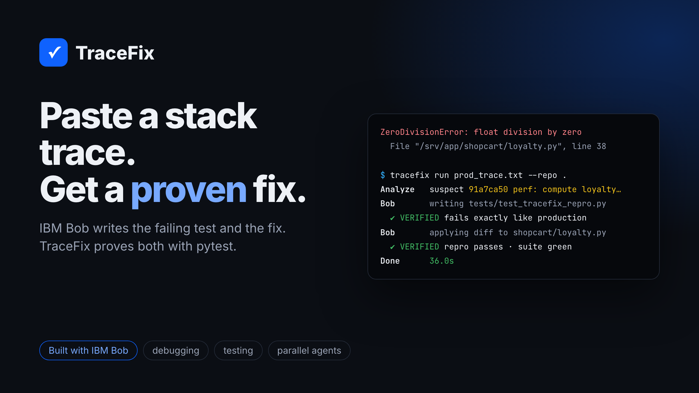

# TraceFix

**Paste a production stack trace. Get a verified failing test and a verified fix.**

TraceFix is an incident-response CLI built on **IBM Bob**. You give it a Python
traceback from your logs and the service's git repo. It returns:

1. an **incident brief**: every frame mapped to a file in the repo, with code context;
2. the **suspect commit**: `git blame` around the crash lines, ranked;
3. a **verified reproduction**: a pytest regression test written by Bob, accepted only
   if it fails with the *same exception* in the *same function* as production;
4. a **verified fix**: written by Bob, accepted only if the reproduction now passes
   **and** the whole existing suite stays green;
5. an **incident branch** with two commits (test, then fix) and an HTML/Markdown report
   whose Markdown is ready to use as a PR description.

> **Bob proposes, TraceFix proves.** Nothing Bob writes is accepted on its word. If a
> gate rejects a change, the exact pytest evidence goes back to the same Bob session
> for another attempt.

🔗 **Live site:** https://mrsameer.github.io/tracefix/ · ▶ [Real run replay](https://mrsameer.github.io/tracefix/demo.html) · 📄 [Incident report](https://mrsameer.github.io/tracefix/report.html)



## Why

When production throws, most of the on-call time goes into turning a stack trace into
something actionable. You have to find the right files, work out which change broke
things, write a reproduction, and only then fix it. The reproduction is the step most
often skipped, which is why the same bugs come back. TraceFix automates exactly that
path, and it treats the AI as a proposal engine behind hard, deterministic gates.

## Results on the demo service

| Incident | Bug | Verified test | Verified fix | Bob attempts |
| --- | --- | --- | --- | --- |
| [INC-4127](https://mrsameer.github.io/tracefix/runs/INC-4127/report.html) | `ZeroDivisionError` in loyalty points (perf commit) | 23 s | **36 s** | 2 |
| [INC-4133](https://mrsameer.github.io/tracefix/runs/INC-4133/report.html) | `KeyError: ''` from stacked coupons (`"SAVE10,"`) | 27 s | **47 s** | 2 agents racing |

An earlier INC-4127 run ([log](docs/runs/run1_with_rejection.typescript)) shows the
feedback loop working. Bob's first reproduction also changed files it was not allowed
to touch. TraceFix rejected it, sent Bob the evidence, and accepted the second attempt.

## Quick start

Requirements: Python 3.11+, [uv](https://docs.astral.sh/uv/), git, and
[IBM Bob Shell](https://bob.ibm.com) logged in once (`bob`). No API key is needed:
TraceFix talks to Bob over the **Agent Client Protocol** (`bob acp`) and reuses your
SSO session.

```bash
git clone https://github.com/mrsameer/tracefix && cd tracefix
uv sync

# build the demo service (a git repo with a planted regression)
uv run python examples/build_demo_repo.py /tmp/shopcart

# deterministic analysis only (no Bob)
uv run tracefix analyze examples/prod_trace.txt --repo /tmp/shopcart

# full pipeline: reproduce + fix with Bob
uv run tracefix run examples/prod_trace.txt --repo /tmp/shopcart --id INC-4127

# second scenario, racing two Bob agents in parallel git worktrees
uv run python examples/add_scenario_coupons.py /tmp/shopcart
uv run tracefix run examples/prod_trace_coupons.txt --repo /tmp/shopcart --agents 2
```

Reports land in `out/<incident-id>/` (`report.html`, `report.md`, `report.json`,
`events.jsonl`).

## How it works

```
traceback ──► parse ──► map to repo ──► git blame ──► ┌───────────── Bob (ACP) ─────────────┐
                                                      │ write tests/test_tracefix_repro.py  │
                                                      └──────────────┬──────────────────────┘
                                   gate: same exception, same function, no other file touched
                                                      ┌──────────────▼──────────────────────┐
                                                      │ fix the root cause                  │
                                                      └──────────────┬──────────────────────┘
                                   gate: repro passes, full suite green, test untouched
                                                                     ▼
                                              incident branch + report (+ PR body)
```

| Module | Responsibility |
| --- | --- |
| `tracefix/trace_parser.py` | Parse CPython tracebacks from noisy logs (chained exceptions, 3.11+ carets) |
| `tracefix/repo_map.py` | Map traceback paths to tracked files by longest suffix; code context |
| `tracefix/blame.py` | `git blame --porcelain` around crash lines; weighted suspect ranking |
| `tracefix/bob_acp.py` | Agent Client Protocol client that drives Bob Shell sessions |
| `tracefix/pipeline.py` | Stages, retry loop with evidence feedback, parallel worktree racing |
| `tracefix/verify.py` | The gates: pytest runner, failure-signature matching, file-scope checks |
| `tracefix/report.py` | JSON / Markdown / HTML incident reports |

**Parallel agents (`--agents N`).** Each Bob agent gets its own `git worktree` and a
different strategy hint. The first to pass the gate wins, its patch is applied to the
incident branch, and the other sessions are cancelled with ACP `session/cancel`.

## How IBM Bob was used

Bob was used in two ways: **as a builder** of TraceFix, and **as the engine** inside it.

**Bob built large parts of this repository.** Each build task was a written prompt
([`bob_prompts/`](bob_prompts)) sent to Bob in agent mode. Every session's full event
stream is saved in [`bob_sessions/`](bob_sessions) as evidence.

| Bob session | What Bob built | Result |
| --- | --- | --- |
| `01_demo_repo` | `examples/build_demo_repo.py`: the shopcart service, 5-commit history with a realistic regression, and a production trace whose line numbers Bob verified by reproducing the crash | 34 tool calls, 219 s |
| `02_parser_blame` | `trace_parser.py`, `repo_map.py`, `blame.py` plus 38 tests (Bob found and fixed its own parser bug during the task) | 38 passing tests |
| `03_gate_tests` | 47 unit tests for the verification gates, reports and prompts | 85 passing tests |

**Bob is the engine at runtime.** TraceFix opens Bob sessions over ACP with full
repository context. Bob explores the code, writes the reproduction, runs pytest itself,
applies a minimal diff and re-runs the suite, just as a developer would. TraceFix then
independently checks the result.

## Development

```bash
uv sync
uv run pytest -q        # 85 tests
```

## License

MIT
